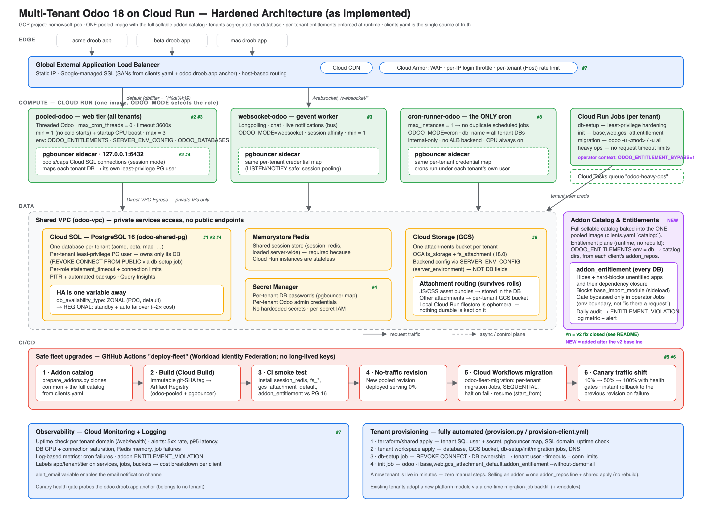

# Odoo v18 on Cloud Run — Multi-Tenant SaaS

This project runs Odoo for many customers ("tenants") at once on Google Cloud
Run. Everyone shares **one Docker image** that contains every addon we sell.
Each customer gets their **own database** (Odoo automatically picks the right
one based on the domain name — `dbfilter = ^(%d|%h)$`), and a separate system
called **entitlements** controls which addons each customer is actually
allowed to use (the `addon_entitlement` module + `ODOO_ENTITLEMENTS`, see §2).
That means selling a customer a new addon is just a config change — we never
need to rebuild and redeploy the image. The architecture closes eight classes
of risk common to multi-tenant SaaS platforms (see the [Design decisions](#15-design-decisions--how-each-risk-is-handled) reference).



```
Internet → tenant domains (acme.nomowsoft.com, beta.nomowsoft.com, ...)
   │
   ▼
Global External Application Load Balancer  (static IP, Google-managed SSL)
   ├─ Cloud CDN (static assets)
   ├─ Cloud Armor: WAF + per-IP login throttle + PER-TENANT (Host) rate limit
   ├─ default                  → pooled-odoo    (Cloud Run, web, min=1, dbfilter)
   └─ /websocket, /websocket/* → websocket-odoo (Cloud Run, gevent, session affinity)

Cloud Run services (each with a pgbouncer sidecar):
   pooled-odoo       web tier: threaded Odoo, max_cron_threads=0, timeout 3600s
   websocket-odoo    gevent worker: chat / longpolling / live notifications
   cron-runner-odoo  THE ONLY cron runner: max_instances=1, internal-only

Data layer (Shared VPC, Direct VPC Egress, private IPs only):
   Cloud SQL PostgreSQL 16 · Memorystore Redis · GCS buckets · Secret Manager

Async / control plane:
   Cloud Tasks "odoo-heavy-ops" · Cloud Run Jobs (db-setup/init/migration)
   Cloud Workflows "odoo-fleet-migration" (sequential, halt-on-fail, resumable)
```

---

## Table of Contents

1. [Directory structure](#1-directory-structure)
2. [The addon catalog — where addons live](#2-the-addon-catalog--where-addons-live)
3. [The image and its three run modes](#3-the-image-and-its-three-run-modes)
4. [Life of a request](#4-life-of-a-request)
5. [Tenant isolation — the layers](#5-tenant-isolation--the-layers)
6. [pgbouncer — how per-tenant DB credentials work](#6-pgbouncer--how-per-tenant-db-credentials-work)
7. [Sessions, attachments, and cron](#7-sessions-attachments-and-cron)
8. [Secrets — who creates what, who reads what](#8-secrets--who-creates-what-who-reads-what)
9. [Terraform — two stacks and why](#9-terraform--two-stacks-and-why)
10. [CI/CD workflows explained](#10-cicd-workflows-explained)
11. [Deployment runbook — clean GCP project, manual, step by step](#11-deployment-runbook--clean-gcp-project-manual-step-by-step)
    - [Phase 0 — Tools & authentication](#phase-0--tools--authentication)
    - [Phase 1 — Enable the required APIs](#phase-1--enable-the-required-apis-one-time-1-min)
    - [Phase 2 — Terraform state bucket](#phase-2--terraform-state-bucket-one-time)
    - [Phase 3 — Validate config & build the addon catalog](#phase-3--validate-config--build-the-addon-catalog)
    - [Phase 4 — Artifact Registry repo + images](#phase-4--artifact-registry-repo--images)
    - [Phase 5 — Apply the shared platform](#phase-5--apply-the-shared-platform-1525-min)
    - [Phase 6 — DNS + SSL certificate](#phase-6--dns--ssl-certificate)
    - [Phase 7 — Provision each tenant](#phase-7--provision-each-tenant)
    - [Phase 8 — Verify the deployment](#phase-8--verify-the-deployment)
    - [Phase 9 — Turn on alerting & CI](#phase-9--turn-on-alerting-recommended--ci-optional)
    - [Optional maintenance (not required to run)](#optional-maintenance-not-required-to-run)
12. [Onboarding a new client (live platform)](#12-onboarding-a-new-client-live-platform)
    - [Step 1 — Declare the client in `clients.yaml`](#step-1--declare-the-client-in-clientsclientsyaml)
    - [Step 2 — Create `clients/<slug>.tfvars`](#step-2--create-clientszed-corptfvars)
    - [Step 3 — Rebuild the image (if the repo is new)](#step-3--rebuild-the-image-only-if-the-repo-is-new-to-the-catalog)
    - [Step 4 — Create the DNS A record FIRST](#step-4--create-the-dns-a-record-first)
    - [Step 5 — Pause the cron runner](#step-5--pause-the-cron-runner)
    - [Step 6 — Provision](#step-6--provision)
    - [Step 7 — Verify and hand over](#step-7--verify-and-hand-over)
    - [Step 8 — Install the client's paid modules](#step-8--install-the-clients-paid-modules)
    - [Selling an addon to an existing client](#selling-an-addon-to-an-existing-client)
    - [Automated onboarding (`repository_dispatch`)](#automated-onboarding-repository_dispatch--setup--usage)
13. [Offboarding / destroying a client](#13-offboarding--destroying-a-client)
    - [Step 1 — Pause the cron runner](#step-1--pause-the-cron-runner)
    - [Step 2 — Back up everything](#step-2--back-up-everything-last-chance)
    - [Step 3 — Drop the database as `odoo_shared`](#step-3--drop-the-database-as-odoo_shared)
    - [Step 4 — Remove the dropped DB from Terraform state](#step-4--remove-the-dropped-db-from-terraform-state)
    - [Step 5 — Destroy the tenant workspace](#step-5--destroy-the-tenant-workspace)
    - [Step 6 — Remove the client from the repo](#step-6--remove-the-client-from-the-repo)
    - [Step 7 — Re-apply the shared platform](#step-7--re-apply-the-shared-platform)
    - [Step 8 — Restore the cron runner, clean up the edges](#step-8--restore-the-cron-runner-clean-up-the-edges)
14. [Migrating an existing live environment (historical)](#14-migrating-an-existing-live-environment-historical--not-needed-on-a-fresh-project)
15. [Design decisions — how each risk is handled](#15-design-decisions--how-each-risk-is-handled)
16. [Deploy-time gotchas — hit once, now handled in code](#16-deploy-time-gotchas--hit-once-now-handled-in-code)
17. [Debugging production — read-only queries & one-off fixes](#17-debugging-production--read-only-queries--one-off-fixes)
18. [clients.yaml validation rules & naming standards](#18-clientsyaml-validation-rules--naming-standards)
19. [Monitoring & alerting — manual GCP Console setup](#19-monitoring--alerting--manual-gcp-console-setup)

---

## 1. Directory Structure

```
.
├── README.md
├── docs/architecture.png              # Architecture diagram (as implemented)
├── clients/
│   ├── clients.yaml                   # SINGLE SOURCE OF TRUTH: sellable addon
│   │                                  #   catalog + per-tenant domain, database,
│   │                                  #   db_user, addon entitlements
│   └── <client>.tfvars                # Per-client Terraform inputs
├── odoo-v18/
│   ├── Dockerfile                     # odoo:18.0 + platform modules + addon catalog
│   ├── entrypoint.sh                  # Generates odoo.conf; ODOO_MODE=web|cron|websocket
│   ├── db-setup.sh                    # Tenant DB hardening (least-privilege user)
│   ├── addons/gcs_attachment_default/ # Repo-owned module (committed here)
│   ├── build-addons/                  # Addon catalog staging (gitignored, built on demand)
│   └── pgbouncer/                     # Sidecar image: per-tenant credential routing
├── scripts/
│   ├── requirements.txt                # pyyaml — installed by every script/workflow that needs it
│   ├── prepare_addons.py              # clients.yaml → clone all addon repos for the build
│   ├── validate_clients.py            # clients.yaml rule checks (R1-R10) + subdomain DNS check
│   ├── provision.py                   # Onboarding: shared apply → tenant apply → db-setup → init
│   ├── destroy.py                     # Offboarding: terraform destroy + workspace cleanup
│   ├── onboard_client.py              # Automated onboarding (§12): validate → provision → install → mask+output creds
│   └── cloud_run_scale.py             # Toggle a shared service's warm floor (--service pooled|cron-runner)
├── terraform/
│   ├── main.tf                        # Per-tenant workspace: DB, bucket, jobs, DNS
│   ├── shared/                        # Platform stack (apply once, re-apply on clients.yaml change)
│   │   ├── main.tf                    #   VPC, SQL, Redis, ALB, Armor, 3 Cloud Run services,
│   │   │                              #   tenant SQL users, Cloud Tasks, Cloud Workflows
│   │   └── outputs.tf                 #   alb_ip, sql_private_ip, certificate_map, ...
│   └── modules/
│       ├── cloud-run-odoo/            # Service module (modes, pgbouncer sidecar, NEG)
│       ├── cloud-run-job/             # Job module (entrypoint-preserving)
│       └── cloud-sql-db/              # Tenant DB + Odoo admin secrets
└── .github/workflows/
    ├── update-fleet.yml               # Build → smoke test → migrate fleet → canary + rollback
    ├── provision-client.yml           # Onboard a tenant: manual (workflow_dispatch) or automated (repository_dispatch, §12)
    └── destroy-client.yml             # Tear down a tenant workspace: manual or automated (repository_dispatch, §12)
```

---

## 2. The Addon Catalog — Where Addons Live

Client addons don't live in this repo — they get pulled in automatically when
we build the image.

### On disk (this repo)

| Location | What's there | How it gets there |
|---|---|---|
| `odoo-v18/addons/` | `gcs_attachment_default` — the one platform module we own | Committed in this repo |
| `odoo-v18/build-addons/` | Empty in git (just `.gitkeep`) | Populated by `scripts/prepare_addons.py` right before every build |

The script `prepare_addons.py` reads `clients/clients.yaml` and downloads the
common repo, plus **every single addon repo we sell** — even ones no client is
currently using. This is on purpose: since every addon is already baked into
the image, turning one on for a client is just a settings change (an
"entitlement"), never a rebuild (see §10 and §12 step 3):

```yaml
common_addon_repo: 'github.com/nomowsoft/Common.git'      # → build-addons/common/
catalog:                       # EVERY sellable repo — all baked into the image
  Human-Resources:                                        # → build-addons/Human-Resources/
    repo:   'github.com/nomowsoft/Human-Resources.git'
    branch: '18.0'
clients:
  mac-corp:
    addon_repos: [Human-Resources]   # ← entitlement: catalog keys this client pays for
```

To populate it locally:

```bash
GITHUB_TOKEN=<pat> python3 scripts/prepare_addons.py --clean
ls odoo-v18/build-addons/     # → common/  Human-Resources/  Accounting/  Odoo-Customization-Module/
```

Our CI pipeline runs this step automatically before building the image, using
the `ADDONS_GITHUB_TOKEN` secret. The `build-addons/` folder is excluded from
git, so private client code never ends up committed to this infra repo. We
also strip the `.git` folders after cloning, so no access token or commit
history ends up inside the built image.

At the end of the first build stage, the Dockerfile runs some safety checks:
every platform module must have a valid `__manifest__.py` file, and a handful
of Python imports (`OpenSSL.crypto`, `redis`, `gcsfs`, `packaging`, and `odoo`
itself) must all succeed. This way, if a module is missing or a Python
dependency is broken, the **build** fails right away with a clear error —
instead of the deploy silently failing four minutes later when Cloud Run
gives up waiting for the container to become healthy.

### Inside the built image (container paths)

The Dockerfile stacks four layers of addons together; `entrypoint.sh` combines
them into Odoo's `addons_path` at startup:

| Container path | Contents | Source |
|---|---|---|
| `/opt/extra-addons` | `session_redis`, `fs_storage`, `fs_attachment`, `server_environment` | Cloned from camptocamp/OCA 18.0 during `docker build` (NOT `/mnt/extra-addons` — that's a VOLUME in the odoo base image; build-time writes there are discarded) |
| `/mnt/platform-addons` | `gcs_attachment_default`, `platform_dblist`, `addon_entitlement`, `platform_cron_safety` | `COPY addons/` |
| `/mnt/custom-shared/common` | Your Common modules | `COPY build-addons/` |
| `/mnt/custom-shared/Human-Resources` | Your Human-Resources modules | `COPY build-addons/` |
| `/mnt/custom-shared/Accounting` | Your Accounting modules | `COPY build-addons/` |
| `/mnt/custom-shared/Odoo-Customization-Module` | Your Odoo-Customization-Module modules | `COPY build-addons/` |
| `/usr/lib/python3/dist-packages/odoo/addons` | Odoo core | Base image `odoo:18.0` |

The entrypoint script automatically finds every folder under
`/mnt/custom-shared/` — so adding a new addon repo to the catalog never
requires touching the Dockerfile or the entrypoint script. The next build
just picks it up.

### Segregation model — entitlements enforced at runtime

The image contains the whole catalog of addons, for every customer. What
actually keeps customers separated and controls what each one can use is a
module called **`addon_entitlement`**, which gets installed automatically
into every **new** customer database. Because it only takes effect in
databases where it's installed, any customer whose database was set up
**before** this module existed needs it installed manually, once (`-u all`
never installs a module that isn't already there — this command is safe to
run more than once):

```bash
gcloud run jobs execute <slug>-odoo-job-migration --region $REGION --wait \
  --args="-d,<db>,-i,addon_entitlement,--stop-after-init"
```

Until that one-time install runs, that customer's database has **no**
restrictions at all on what modules are visible or installable. You can check
with the daily audit described below, or by running the install command
above. Once installed, the module enforces:

- **Visibility**: if a client's `addon_repos` list doesn't include a catalog
  repo, its modules are hidden everywhere in the Apps list and in search.
  Anything already installed keeps working regardless — a mistake in the
  entitlement list can only block a new install, it can never break something
  a customer is already using.
- **Install gate**: trying to install or upgrade a module the client isn't
  entitled to (or anything that depends on one) is blocked with a clear "not
  included in your subscription" error. This block applies everywhere —
  there's no backdoor through elevated permissions (`sudo()`) or through
  automated jobs like scheduled tasks (cron). The same protection covers
  direct database writes and uninstalling the entitlement check itself, so
  nothing — not even a routine fleet-wide update — can sneak an unentitled
  module in.
- **Only we can install modules, not the customer**: the one exception to all
  of this is the Cloud Run Jobs we run ourselves for provisioning and
  migrations — those set an env var, `ODOO_ENTITLEMENT_BYPASS=1`, that lifts
  the restriction. The three always-on services never set this variable, and
  customers have no way to set container environment variables themselves, so
  this flag is what draws the line between "us" and "the customer." If the
  flag isn't set, the restriction is always enforced.
- **Where entitlements come from**: an environment variable called
  `ODOO_ENTITLEMENTS` maps each database to the addon folders it's allowed to
  use. Terraform generates this variable from `clients.yaml` and applies it to
  all three services. So selling an addon to a client is just: add one line to
  `addon_repos`, then re-apply Terraform (which rolls out with zero downtime)
  — no image rebuild, no database migration needed.
- **No uploading custom modules**: the feature that lets you upload a module
  as a zip file (`base_import_module`) is disabled for every customer —
  allowing that would let anyone run arbitrary code on our shared servers.
- **We also watch for mistakes**: a scheduled job runs every day and logs a
  warning (`ENTITLEMENT_VIOLATION`) if it finds any module installed that a
  customer isn't actually entitled to; Terraform turns that warning into an
  alert we get notified about. Think of this as a paywall with an alarm
  attached, not an unbreakable vault — real code-level isolation between
  customers is a future "premium" tier idea, and the folder for it
  (`/mnt/client-addons`) is already reserved but not built yet.

---

## 3. The Image and Its Three Run Modes

One image can play three different roles. When a container starts,
`entrypoint.sh` looks at the `ODOO_MODE` variable, writes the right
`/etc/odoo/odoo.conf` config file for that role, and then starts Odoo:

| | `ODOO_MODE=web` (default) | `ODOO_MODE=cron` | `ODOO_MODE=websocket` |
|---|---|---|---|
| Used by | `pooled-odoo` | `cron-runner-odoo` | `websocket-odoo` |
| Process | `odoo` (threaded, `workers=0`) | `odoo` (threaded) | `odoo gevent` |
| Tenant routing | `dbfilter = ^(%d|%h)$` (hostname → DB) | `db_name = <all tenant DBs>` | `dbfilter = ^(%d|%h)$` |
| Cron threads | `0` — never | `MAX_CRON_THREADS` (default 2) — **only here** | `0` — never |
| Listens on | `$PORT` (http) | `$PORT` (http, probes only) | `$PORT` (`gevent_port`) |

Shared behavior in every mode:

- `workers = 0` (called "threaded mode") — one container handles many
  requests at the same time using threads, which matches how Cloud Run
  expects containers to behave.
- `list_db = False` (no database picker shown to visitors), `proxy_mode =
  True` (Odoo trusts the load balancer's headers), and internal limits are
  all set to match Cloud Run's 3600-second timeout.
- If `REDIS_HOST` is set, Odoo loads the `session_redis` module and the right
  `ODOO_SESSION_REDIS_*` variables get exported — this is what makes user
  sessions live in Memorystore (Redis) instead of on local disk.
- `DB_HOST` points at the pgbouncer sidecar (`127.0.0.1:6432`) for the
  long-running services, or straight at Cloud SQL's private IP for one-off
  jobs, which don't have a sidecar.
- `running_env = prod` (can be overridden with `RUNNING_ENV`) — this is
  required by the OCA `server_environment` module, which `fs_storage` depends
  on.

Why don't jobs override the entrypoint script? Because `/entrypoint.sh` is
what actually writes `odoo.conf` in the first place. So Cloud Run Jobs keep
using the same entrypoint and just add extra arguments on top (like `-d acme
-u all --stop-after-init`). The one exception is the db-setup job, which
skips Odoo entirely and runs `/db-setup.sh` directly — it's just raw `psql`
commands.

---

## 4. Life of a Request

What happens when a user opens `https://acme.nomowsoft.com/web`:

1. **DNS** — the customer's domain has an A record pointing at our shared load
   balancer's static IP. The customer (or we, for platform subdomains) adds
   this record at their own DNS provider.
2. **Load balancer** — the request hits our load balancer, which handles
   HTTPS using a Google-managed certificate. The list of domains on that
   certificate is generated automatically from `clients.yaml`.
3. **Cloud Armor** (our firewall) checks the request: first general
   web-attack rules, then a per-IP limit on login attempts (60/minute), then
   a per-customer request budget (600/minute by default) so that one busy
   customer can't slow things down for everyone else.
4. **Cloud CDN** serves anything that's just a static file (images, CSS, JS)
   straight from cache — it never even reaches Cloud Run.
5. **Routing** — based on the URL path, `/websocket*` goes to the
   `websocket-odoo` service, and everything else goes to `pooled-odoo`.
   Neither service can be reached directly from the internet — they only
   accept traffic that comes through the load balancer.
6. **Odoo itself** sees the request's `Host` header (`acme.nomowsoft.com`) and
   uses a setting called `dbfilter` to figure out exactly which database that
   maps to (see the naming rules below). It looks up the user's session in
   **Redis**, not on local disk — so it doesn't matter which container
   instance picks up the request, since none of them store anything locally.
7. **Talking to the database** goes through a helper process running
   alongside Odoo called the **pgbouncer sidecar** (at `127.0.0.1:6432`). It
   connects to Cloud SQL using *that specific customer's own database login*,
   not a shared one (details in §6).
8. **Files/attachments** are streamed directly from that customer's own
   Google Cloud Storage bucket over an API, using the container's built-in
   Google identity — no stored keys, no mounted drives.

### Host → database naming rules

The setting `dbfilter = ^(%d|%h)$` can match a database name two different
ways. Odoo replaces `%d` with just the **first part** of the domain (e.g.
`acme` from `acme.nomowsoft.com`, after removing any `www.`), and `%h` with
the **whole domain**. So a database can be named either way and still match:

| Request Host | Matches a DB named | Convention |
|---|---|---|
| `beta.nomowsoft.com` | `beta` | Normal case: DB named after the subdomain |
| `example.com` | `example` | Apex domains: first label works the same |
| `super.droob.com` + `super.example.com` | `super.droob.com` / `super.example.com` | First-label **collision**: both DBs use the full domain; a DB named just `super` must not exist |

Both forms work, but our onboarding script always names new databases using
the **full domain** (shortened if needed to fit Postgres's 63-character
limit), never just the first part. This guarantees the database name is
always unique — two different domains can never produce the same database
name this way, whereas using just the first part could theoretically collide
between two clients. The full list of naming rules is in §18.

These rules aren't just documentation — they're checked automatically, and a
bad or ambiguous entry gets rejected before we touch any real infrastructure.
There are three separate checks:

1. **`scripts/validate_clients.py`** (§18) runs automatically as part of
   `provision.py` and `prepare_addons.py`, so every CI build and every
   onboarding fails fast if something's wrong. It checks for duplicate client
   names (YAML would otherwise silently keep only one!), duplicate domains,
   duplicate databases/database users, and that every domain maps to exactly
   one database.
2. **Terraform double-checks the same rules** on the SSL certificate resource
   when you run `plan` or `apply` — this catches anything that somehow
   skipped the Python script.
3. **Odoo itself** is the last line of defense — because `list_db = False`, a
   domain that matches zero or more-than-one database just shows an error
   page, never a list of databases to pick from.

---

## 5. Tenant Isolation — The Layers

This uses a "defense in depth" approach — even if one layer of protection
fails, a customer's data still isn't exposed to another customer, because of
the layers below it.

| Layer | Mechanism | What it stops |
|---|---|---|
| Edge | Per-tenant (Host) rate limit in Cloud Armor | One tenant flooding the platform |
| App | `dbfilter = ^(%d|%h)$` + `list_db = False` | Cross-tenant DB selection from the UI |
| Connection | pgbouncer maps each DB → that tenant's PG user | A dbfilter bug or Odoo exploit reading another tenant's DB |
| Database | `REVOKE CONNECT FROM PUBLIC`; tenant user owns only its DB | Any connection to a foreign DB, even with valid creds |
| DB resources | Per-role `statement_timeout` + `CONNECTION LIMIT` | A runaway tenant query starving the instance |
| Storage | One GCS bucket per tenant, IAM per bucket | Cross-tenant file access |
| Secrets | One Secret Manager secret per tenant credential | Blast radius of a leaked credential |
| Modules | Install-by-job only; no Apps rights for tenants | A tenant enabling another client's addons |

---

## 6. pgbouncer — How Per-Tenant DB Credentials Work

Here's a tricky problem: a single Odoo process (serving many customers) only
has **one** database login configured — it can't switch to a different
PostgreSQL username depending on which customer's database it's talking to.
So giving each customer their own database user would be pointless... unless
something else does the switching for it. That something is the **pgbouncer
sidecar** (`odoo-v18/pgbouncer/`), a small helper process that runs alongside
each Odoo container.

When the sidecar starts up, its own `entrypoint.sh` builds a config file
(`pgbouncer.ini`) from environment variables:

```ini
[databases]
acme  = host=<sql-private-ip> dbname=acme  user=acme_production2 password=***   ; ← tenant user
beta  = host=<sql-private-ip> dbname=beta  user=beta_production  password=***
*     = host=<sql-private-ip>                                                    ; ← fallback: platform user

[pgbouncer]
pool_mode = session          ; Odoo needs LISTEN/NOTIFY (bus) + advisory locks
default_pool_size = 5        ; server connections per db
max_db_connections = 10      ; hard cap per db (noisy-neighbor containment)
```

Where the pieces come from:

| Piece | Source |
|---|---|
| The tenant map (`PGB_TENANTS`) | Terraform builds it from `clients.yaml` (`database` + `db_user` per client) |
| Tenant passwords (`TENANT_DB_PASSWORD_<SLUG>` env) | Injected from Secret Manager per tenant by the `cloud-run-odoo` module |
| Frontend auth (what Odoo logs in with) | The platform user `odoo_shared` — valid only on the loopback interface inside the instance |

So here's what actually happens: Odoo connects to database `acme` at
`127.0.0.1:6432`, logging in locally as the shared platform user
`odoo_shared`. pgbouncer checks that login, then makes its **own** connection
to Cloud SQL — but as `acme_production2`, a database user that is only
allowed to connect to the `acme` database (everything else was revoked when
the tenant was set up).

Adding a new customer to `clients.yaml` and re-applying `terraform/shared`
automatically rolls out new versions of all three services with the updated
customer-to-user map (this is step 1 of `provision.py`).

This same sidecar also solves another problem — running out of database
connections (Fix #2). No matter how many Odoo threads or container instances
are running, pgbouncer's own connection-pool limits (`default_pool_size`/
`max_db_connections`) keep Cloud SQL's total connection count under control.

---

## 7. Sessions, Attachments, and Cron

### Sessions → Memorystore Redis

Cloud Run containers are temporary — anything saved to local disk disappears
when the container goes away. To work around this, a module called
`session_redis` is loaded for the whole server, so every user's login session
gets stored in Redis instead of on disk. That means any container instance —
even a brand new one right after a deploy — can pick up any user's session.
This is all configured through environment variables (`REDIS_HOST` gets
turned into the right `ODOO_SESSION_REDIS_*` settings by the entrypoint
script); nothing needs to be set up per database.

### Attachments → GCS via API

For files and attachments, two modules (`fs_storage` and `fs_attachment`)
store them in Google Cloud Storage using GCS's own API. We deliberately don't
use "GCS FUSE" (a way of mounting cloud storage as a local drive) because its
weaker guarantees can corrupt files, and we don't use Google Filestore either,
because it costs more. Each customer's database installs a chain of modules
to make this work: `gcs_attachment_default → fs_attachment → fs_storage →
server_environment`. All of these are already baked into the image and get
checked both at build time and in CI.

Important detail: the actual GCS connection settings (which bucket, which
protocol, etc.) come **entirely from environment variables**, not from a
database write. Once `server_environment` is installed, those settings become
"server-environment fields" — meaning if you try to set them directly on the
database record instead, Odoo silently ignores the write (there's no longer a
real database column behind them). This exact mistake caused a real incident
— see the gotcha table in §16. Our own `gcs_attachment_default` module just
creates a placeholder database record; the real connection settings come from
the `SERVER_ENV_CONFIG` environment variable. This variable **must be present
on every process that could possibly write an attachment** — that means the
three main services, and also the per-customer `init`/`migration` Cloud Run
Jobs (each has its own separate copy of this setting in Terraform, since
they're two separate Terraform configs). There's also a leftover `GCS_BUCKET`
variable on those Jobs — nothing in the code actually reads it anymore, so
don't rely on it.

Small images (menu icons, avatars — under 50KB by default) are deliberately
kept **in the database itself** rather than in GCS, and the same is true for
the CSS/JS bundles the browser loads on every page, regardless of size. This
is intentional — it's faster to serve things that get requested constantly —
not a bug. So don't assume a record with no `store_fname` (i.e., stored in
the database, not GCS) is broken. To tell a correctly-GCS-stored file from a
leftover local-disk one, check whether `store_fname` starts with
`gcs_att://` or is a plain hash-style path instead.

### Cron → one dedicated runner (Fix #8)

There's a classic problem with running scheduled tasks on Cloud Run: if you
let every autoscaled container run cron jobs, you get duplicates, and
containers also don't get CPU time when they're not actively handling a
request. Here's how we solve it:

- Every web and websocket container has `max_cron_threads = 0` — they never
  run scheduled tasks at all.
- Only one service, `cron-runner-odoo`, runs scheduled tasks. It's locked to
  exactly one instance (`max_instances = 1`) so there's never a duplicate,
  always has at least one instance running with CPU actually allocated to it
  (so background threads really do get CPU time), and it can't be reached
  from the internet at all — no load balancer route to it.
- It's configured with the list of every customer's database (generated
  automatically from `clients.yaml`), so this one service handles scheduled
  tasks for the entire platform. It uses the same pgbouncer setup as
  everything else, so each customer's scheduled tasks still run as that
  customer's own database user.

Running one process's scheduled-task loop across every tenant database like
this triggers a real Odoo core bug: `ThreadedServer.cron_thread` iterates an
internal dict of database registries without holding its own lock, so a
registry being loaded or evicted on another thread while that loop is
running can crash it with `RuntimeError: OrderedDict mutated during
iteration` — permanently killing that cron thread (not just one job) until
the container restarts. A single-tenant Odoo deployment rarely triggers
this, but running many tenants' cron threads concurrently in one process is
exactly the condition that does. The repo-owned `platform_cron_safety`
module patches `cron_thread` at server startup with an otherwise-identical
copy that takes a lock-guarded snapshot of the registry dict before
iterating it, closing the race. It's loaded server-wide alongside
`platform_dblist` (`entrypoint.sh`), so it's active everywhere, though the
Cron Runner is the only service where the bug can actually fire.

### Heavy operations → Cloud Tasks + Jobs (Fix #3)

Big jobs — large reports, imports — shouldn't run inside a normal web
request, since those have a timeout. Instead, there's a Cloud Tasks queue
called `odoo-heavy-ops` for queuing up Cloud Run Job runs instead. Jobs don't
have a request timeout, and the queue itself handles retries and rate
limiting.

---

## 8. Secrets — Who Creates What, Who Reads What

| Secret (Secret Manager) | Created by | Read by |
|---|---|---|
| `odoo-shared-db-password` | terraform/shared | All services (pgbouncer frontend + fallback), db-setup job |
| `<slug>-db-password` (per tenant) | terraform/shared (from `clients.yaml`) | pgbouncer sidecars (per-tenant backend creds), tenant init/migration jobs |
| `<slug>-admin-user` / `<slug>-admin-password` | tenant workspace (`cloud-sql-db` module) | Provisioning jobs (Odoo admin login for the tenant) |
| `odoo-shared-admin-password` | terraform/shared | Services (Odoo master password env) |

Some rules are baked into Terraform: no actual secret value ever appears in
the code itself, Terraform's state file only stores references to secrets
(not the values), and each service account is only given access to the exact
secrets it needs — the `cloud-run-odoo` module automatically grants access to
per-customer secrets based on the customer list.

**Order matters here**: Cloud Run checks that a service actually has
permission to read a secret at the moment it's *created*, so permissions must
exist before whatever needs them. The code enforces this everywhere —
services wait on their permission grants, secret outputs wait on their own
grants, and `provision.py`/`provision-client.yml` will automatically retry
once after a 30-second wait, in case the permission hasn't finished
propagating yet (this is safe, since re-running an apply doesn't cause any
harm).

---

## 9. Terraform — Two Stacks and Why

### `terraform/shared` — the platform (apply once, re-apply on `clients.yaml` change)

This is where the shared platform infrastructure lives: the network (VPC,
subnet, private connections), the Cloud SQL database instance, Redis, the
Docker image registry, the firewall (Cloud Armor), the load balancer
(certificate, routing, backends), the **three Cloud Run services**, **each
customer's database user and password secret**, the task queue, and the
fleet-migration workflow.

Why do customer database users live *here*, instead of in each customer's own
Terraform setup? Because the shared pgbouncer sidecar needs every customer's
password secret in its environment variables. If each customer's own
Terraform setup created those secrets instead, the shared services and the
customer setups would end up racing each other on the very first apply — a
chicken-and-egg problem. By generating everything from `clients.yaml` in one
place, a single `apply` updates the users, secrets, pgbouncer settings, and
certificate domains all together, as one atomic change.

**Two ways to handle the SSL certificate, controlled by one flag — currently
Certificate Manager.** The original approach was a single Google-managed
certificate covering every customer's domain. The catch: a Google-managed
certificate only goes live once **every single domain on it** is pointing at
us — so one client who's slow to update their DNS blocks HTTPS renewal for
**everyone**.

This platform has since switched `enable_certificate_manager`'s default to
`true`, moving to a better approach: **Certificate Manager**, where every
domain (each client's, plus the platform's own anchor domain) gets its **own
separate certificate**. Now, one domain stuck waiting for DNS only blocks its
own certificate, not everyone else's. This is the platform's normal, live
setup — a routine `plan`/`apply` needs no flag to match it. Flipping the
variable to `false` would be the real, deliberate change (it briefly
interrupts HTTPS for every existing customer during the cutover back), so
*that* direction is never something that should happen as a side effect of a
routine deploy — it needs its own separate, confirmed apply:

```bash
scripts/tf.sh shared apply -var enable_certificate_manager=true   # already the default; explicit here for clarity
# then confirm every domain reaches ACTIVE independently:
scripts/tf.sh shared output -json certificate_status
```

Onboarding a new client works the same either way — if this flag hasn't been
turned on yet, the onboarding script just logs a warning that a certain DNS
record isn't available yet (the main DNS instructions are unaffected). A
client's HTTPS won't actually turn on until this migration has been applied,
but that never blocks the rest of onboarding from completing.

#### The anchor domain `saas-dev.nomowsoft.com` — why it exists

Alongside every client's own domain, one extra domain —
`saas-dev.nomowsoft.com` — is always included in the certificate. It doesn't
belong to any client and doesn't match any database, so visiting it in a
browser just shows "The database manager has been disabled by the
administrator" — that's expected (see isolation gate 3 in §4). This domain
isn't for humans to visit — it exists for our own automated systems:

1. **Our deploy pipeline's health checks use it.** Every step of a gradual
   rollout (10% → 50% → 100% of traffic) is gated on this domain responding
   at `/web/health`, a health check endpoint that works even without a
   database attached. This exercises the full real path a request takes —
   DNS, certificate, load balancer, firewall, service — through a domain
   that **no customer owns**. If we used a real customer's domain for this
   instead, the deploy pipeline would break the day that customer leaves and
   their domain gets removed from the certificate.
2. **It keeps the certificate valid no matter how many customers we have.** A
   certificate must always contain at least one domain, and every other
   domain on it comes from `clients.yaml`. If we had zero customers — brand
   new platform, or everyone offboarded — we wouldn't even be able to create
   a certificate at all without this anchor domain.
3. **It's the one domain we're always guaranteed to control ourselves**, so
   the requirement that every domain on the certificate must resolve before
   it goes live (see §16) never depends entirely on customers' own DNS being
   set up correctly.

Don't remove this domain from the certificate, and keep its DNS record
pointing at the load balancer. If the plain error page bothers anyone who
stumbles onto it, you could add a routing rule that redirects everything
except `/web/health` to a nicer landing page — but that's purely cosmetic.

Notable variables (`terraform/shared/variables.tf`):

| Variable | Default | Purpose |
|---|---|---|
| `db_availability_type` | `ZONAL` | Flip to `REGIONAL` for HA (Fix #1) — in-place change, ~2× DB cost |
| `db_flags` | `max_connections=100` | Instance-wide PG flags |
| `pooled_min_instances` / `pooled_max_instances` | 1 / 3 | Warm floor (no cold starts) / DB-connection cap |
| `per_tenant_rate_limit_per_minute` | 600 | Cloud Armor per-Host budget |
| `enable_certificate_manager` | `true` | Per-domain Certificate Manager (above), the live setup. Flipping to `false` reverts to the legacy shared-SAN cert — a deliberate, isolated apply, never a side effect of a routine one |

### `terraform/` — one workspace per tenant

Each customer gets their own Terraform "workspace" (`terraform workspace
select <slug>`) plus its own `clients/<slug>.tfvars` file. This creates that
customer's **database**, their **storage bucket** (with the right
permissions for the shared services), and the three **Cloud Run Jobs** used
to set it up and maintain it (db-setup / init / migration). DNS is never
managed by Terraform. It also reads `clients.yaml` (for the database
username), which is why the tfvars file itself stays small.

### Modules

| Module | Provides |
|---|---|
| `cloud-run-odoo` | Cloud Run v2 service: run modes, optional pgbouncer sidecar with per-tenant secret env, NEG/ingress/public-access toggles, probes, labels. `ignore_changes` on image + traffic — **CI owns those** |
| `cloud-run-job` | Cloud Run v2 job preserving the image entrypoint (so `odoo.conf` gets generated); `env_extra` for TENANT_DB / SERVER_ENV_CONFIG etc. — **the init and migration jobs must set `SERVER_ENV_CONFIG`** (§7) or attachments they create fall back to the job's local disk and are lost when it exits |
| `cloud-sql-db` | Tenant database + Odoo admin credential secrets |

---

## 10. CI/CD Workflows Explained

### The upgrade model — code vs database (read this first)

When people say an Odoo addon got "updated," that's actually **two separate
things** happening, and they travel through the system in different ways:

| Layer | Lives in | How it changes | Who receives it |
|---|---|---|---|
| **Code** (addon files, Odoo source) | The shared Docker image | Image rebuild → rollout to the Cloud Run services | **Every tenant at once** — pooled tier, one image, no way to hold a tenant back on old code |
| **Database** (schema, views, stored data) | Each tenant's Cloud SQL database | Odoo run with `-u <module>` against that DB (the **migration job**) | **Only the tenant(s) it's run for** |
| **Odoo version itself** (18 → 19) | Base image + heavy DB conversion | Out of scope — plain `-u all` cannot do major upgrades (OpenUpgrade / Odoo's upgrade service territory); this platform is pinned to v18 | — |

Just deploying new code does **nothing** to any database by itself — new
fields, changed screens, and data updates only actually apply once Odoo is
run with the `-u` flag against that specific database. The regular running
service never does this on its own. So every upgrade really has two steps:
*first, rebuilding the image delivers the new code; then, a migration job
updates each customer's database to match it.*

#### The three per-tenant Cloud Run Jobs

Each customer's Terraform workspace creates three jobs (`terraform/main.tf`)
— they use the same Odoo image as the regular services, but they're one-off
containers that run once and then stop:

| Job | Runs | What it does |
|---|---|---|
| `<slug>-odoo-job-db-setup` | At provisioning (and re-run after init) | `/db-setup.sh` — pure `psql` as the shared admin: creates the tenant's database user, locks CONNECT to it, transfers ownership, applies `statement_timeout` + connection limit. No Odoo. |
| `<slug>-odoo-job-init` | First provisioning only | `odoo -d <db> -i base,web,gcs_attachment_default,addon_entitlement --without-demo=all --stop-after-init` — builds the initial schema, installs the web client, binds the GCS attachment storage record, and installs the entitlement gate |
| `<slug>-odoo-job-migration` | Every upgrade | Default args `odoo -d <db> -u all --stop-after-init` — reload every installed module and apply schema/view/data changes to this tenant's database |

Who calls the migration job? The `odoo-fleet-migration` Cloud Workflow runs
it for every customer, **one at a time, using `-u all`** — this is for
platform-wide changes (a new base image, a change to the common repo, or a
change to a shared module) where every affected database needs updating.
There's deliberately no shortcut for "just update this one client" or "just
this one module" — since the image is shared, any code change reaches every
customer's containers no matter who you meant it for. The `update-fleet`
workflow is the only one that rebuilds and rolls out a new image, and it
always migrates every customer first.

Migrations deliberately run as a separate job, not on the live service — the
`--stop-after-init` flag means one dedicated process does the database change
and then exits, instead of competing with live web requests while they're
happening. One important detail: `update-fleet` points the jobs at the new
image **before** running migrations (step 5 below), because migrations need
to run the *new* code, not the old one.

#### ⚠️ Why undeclared addons are blocked (entitlement enforcement)

Since the shared image contains the **entire** catalog for every customer, in
theory nothing used to stop a customer's database from installing a module
that client hadn't actually paid for. That's exactly what `addon_entitlement`
(§2) now prevents — hidden and blocked from installing. The reason this
matters isn't just about billing, it's about *keeping the database schema in
sync*:

1. The shared image gets rebuilt and rolled out — now every customer's
   containers are running the **new** code (code always reaches everyone, as
   explained above).
2. The migration step (`-u`) only runs against the databases of customers
   who **have declared** that addon (that's the only list fleet migration
   knows about).
3. So a customer who never declared the addon would end up running
   brand-new code against an **out-of-date database** — broken screens,
   missing columns, errors — until someone manually runs their migration job
   with `-u <module>`.

The rule: `clients.yaml` is always the source of truth for *who has what*.
Giving a client access to a catalog addon means: add it to their
`addon_repos` **first**, apply `terraform/shared` (this turns the
entitlement on live, no rebuild needed), then install the module using their
migration job (§12 step 8). And even if someone skips a step, the daily
audit and alert will catch it.

### `update-fleet.yml` — the safe fleet upgrade (Fix #5)

> **ℹ️ Triggering this workflow always re-clones every catalog addon repo at
> its current branch HEAD — nothing is version-pinned.** Step 1
> (`prepare_addons.py --clean`) wipes `build-addons/` and does a fresh `git
> clone -b <branch>` of the common repo plus every repo under `catalog:` in
> `clients.yaml`, every single run. There's no commit-SHA pinning per addon
> repo and no change-detection — you get whatever is currently on each
> repo's tracked branch (e.g. `18.0`) at that moment, whether or not
> anything actually changed since the last run, and it's all-or-nothing:
> you can't rebuild with just one addon repo's update while leaving the
> others as they were. So if an addon repo gets new commits pushed to its
> tracked branch, nothing here reacts to it automatically (this workflow
> only runs on manual `workflow_dispatch`) — those commits just sit there
> until someone deliberately triggers `update-fleet.yml`, at which point
> *every* catalog repo's current branch HEAD gets picked up at once.

| Step | What happens | Why |
|---|---|---|
| 1. Addon catalog | `prepare_addons.py --clean` clones all repos from `clients.yaml`, fresh, at their current tracked-branch HEAD | The image must contain the full catalog |
| 2. Build | Cloud Build → `odoo-pooled:<git-sha>` + `pgbouncer:<git-sha>` (also tagged `latest`) | Immutable tags — you always know what's running |
| 3. Smoke test | Installs `base,session_redis,fs_storage,fs_attachment,gcs_attachment_default` against a disposable Postgres 16 in CI | Catches broken platform modules **before** anything deploys (Fix #6) |
| 4. No-traffic revision | New pooled revision at 0% traffic | The new code exists but serves nobody |
| 5. Job re-point | All tenants' jobs updated to the SHA image | Migrations must run the *new* code |
| 6. Fleet migration | `gcloud workflows run odoo-fleet-migration` — one tenant at a time, **halts on first failure**, resumable via the `start_from` input | No more mixed-version chaos at tenant 15 of 40 |
| 7. Canary | Traffic 10% → 50% → 100%, health-gated on `/web/health` through the ALB; any 5xx → instant rollback to the previous revision | Bad revision never reaches all users |
| 8. Finalize | Traffic reset to `--to-latest`; websocket + cron-runner rolled | Future Terraform revisions (e.g. new tenant in the pgbouncer map) serve immediately |

### `provision-client.yml` / `destroy-client.yml`

Each of these two workflows can be started **two different ways**, both
feeding into the same job — the workflow checks `github.event_name` to tell
which one triggered it:

| Trigger | Runs | For |
|---|---|---|
| `workflow_dispatch` (manual, Actions UI) | For `provision-client.yml`: `scripts/provision.py` against an **existing** `clients.yaml` entry, or `scripts/onboard_client.py` for a new one (branches on whether `client_slug` already exists). For `destroy-client.yml`: `scripts/destroy.py` against an existing entry | The CI equivalent of running those scripts locally, without needing a PAT to fire `repository_dispatch` |
| `repository_dispatch` (`types: client-onboarding` / `client-offboarding`) | `scripts/onboard_client.py`, which **adds** the `clients.yaml` entry itself from the payload, then runs the full flow | The automated path (§12's "Automated onboarding" subsection has setup + usage) |

These workflows need a few things configured in GitHub. **Secrets**:
`GCP_WORKLOAD_IDENTITY_PROVIDER`, `GCP_SERVICE_ACCOUNT`, `ADDONS_GITHUB_TOKEN`
(a read-only access token for the private addon repos, also used to resolve
addon names during automated onboarding), and `SENDGRID_API_KEY` (for sending
email). **Repo variables** (a separate GitHub setting from secrets — Settings
→ Actions → Variables): `GCP_PROJECT`, `NOTIFY_EMAIL_FROM`, `NOTIFY_EMAIL_TO`.
Neither Terraform nor these workflows have a project or state bucket
hardcoded anywhere — `GCP_PROJECT` (and the bucket name derived from it) is
the single source of truth for CI, matching how `scripts/tf.sh` works
locally.

---

## 11. Deployment Runbook — Clean GCP Project, Manual, Step by Step

This runbook is written for a **completely empty, freshly created project**
(`project-b85b49c5-5bdc-48ac-989`). Run every command from the **root of this
repo** in your terminal. The phases must be done **in order** — each one
tells you what to expect and how to check it worked before moving to the
next.

### Phase 0 — Tools & authentication

Required locally: `gcloud`, Terraform ≥ 1.8, Python 3.9+, git.

```bash
export PROJECT=project-b85b49c5-5bdc-48ac-989
export REGION=europe-west1

gcloud auth login
gcloud auth application-default login     # Terraform uses these credentials
gcloud config set project $PROJECT
gcloud auth application-default set-quota-project $PROJECT
```

> **ℹ️ Note:** the last command matters even if you've logged in with
> `application-default login` before. Your local credentials have their own
> separate **"quota project"** setting — this is what GCS and API calls get
> billed to, and it doesn't automatically match whatever project you have
> active with `gcloud config`. If this quota project setting is left over
> from a previous project, you'll get a confusing `UserProjectAccountProblem`
> / "billing account not in good standing" error that has nothing to do with
> `$PROJECT`'s actual billing. `scripts/tf.sh` and `scripts/provision.py` fix
> this automatically every time they run, so this only matters if you're
> running `terraform`/`gcloud` directly instead of through those scripts.

### Phase 1 — Enable the required APIs (one time, ~1 min)

```bash
gcloud services enable \
  compute.googleapis.com run.googleapis.com sqladmin.googleapis.com \
  redis.googleapis.com servicenetworking.googleapis.com \
  artifactregistry.googleapis.com secretmanager.googleapis.com \
  cloudbuild.googleapis.com workflows.googleapis.com cloudtasks.googleapis.com \
  monitoring.googleapis.com logging.googleapis.com storage.googleapis.com \
  iam.googleapis.com dns.googleapis.com certificatemanager.googleapis.com
```

Give it a minute after this returns — API activation is eventually consistent.

> **ℹ️ Note:** this manual step only exists to get Phase 2's storage bucket
> working — Terraform needs `storage.googleapis.com` turned on before it can
> even start up and connect to its own state storage, and Terraform can't
> turn that on for itself first (a chicken-and-egg problem). Every API on
> this list is also declared in `terraform/shared/apis.tf`, and Terraform is
> set up to enable them itself as needed — so once Phase 2 is done,
> `terraform apply` will automatically fix a project that's missing one of
> these APIs, without you needing to remember this list. If you skip this
> whole list and jump straight to Phase 2, the only thing that will actually
> fail is `storage.googleapis.com` — nothing else is needed until Terraform
> starts running.
>
> **A real problem this caused (2026-08-08):** after moving to a new
> project, this list was run once, but `certificatemanager.googleapis.com`
> wasn't on it yet — a later change added a Certificate Manager feature that
> needed it, and nobody thought to re-run the enable command for the new
> API. The first attempt to turn that feature on failed with an error
> saying the Certificate Manager API wasn't enabled.
> `terraform/shared/apis.tf` now prevents this from happening again — any
> API a future change needs just gets added to one list there, and Terraform
> enables it automatically the next time you apply, instead of relying on
> someone remembering to update this README and run a command by hand.

### Phase 2 — Terraform state bucket (one time)

Neither of the two Terraform configs has a storage bucket hardcoded into it —
`scripts/tf.sh` (which you'll use for every Terraform command from here on)
figures out the bucket name automatically from whatever project `gcloud`
currently has active, using the pattern `<project>-tf-state`. You need to
create that bucket once, per project:

```bash
gcloud storage buckets create gs://${PROJECT}-tf-state \
  --location=$REGION --uniform-bucket-level-access
gcloud storage buckets update gs://${PROJECT}-tf-state --versioning
```

### Phase 3 — Validate config & build the addon catalog

```bash
python3 -m venv .venv && .venv/bin/pip install -q pyyaml
.venv/bin/python scripts/validate_clients.py        # must print "clients.yaml OK"

# Clone common + all client addon repos into odoo-v18/build-addons/
GITHUB_TOKEN=<your-github-pat> .venv/bin/python scripts/prepare_addons.py --clean
ls odoo-v18/build-addons/                            # expect: common/  Human-Resources/  Accounting/  Odoo-Customization-Module/
```

### Phase 4 — Artifact Registry repo + images

The Cloud Run services we'll create in Phase 5 need both Docker images to
already exist — but the image registry itself is something Terraform
creates. So we create **just the registry** first with a targeted apply,
then build the images:

```bash
scripts/tf.sh shared init
scripts/tf.sh shared apply \
  -target=google_artifact_registry_repository.odoo_repo

# On a fresh project, grant Cloud Build's runtime SA push access (one time)
PROJECT_NUMBER=$(gcloud projects describe $PROJECT --format='value(projectNumber)')
gcloud projects add-iam-policy-binding $PROJECT \
  --member="serviceAccount:${PROJECT_NUMBER}-compute@developer.gserviceaccount.com" \
  --role=roles/artifactregistry.writer
gcloud projects add-iam-policy-binding $PROJECT \
  --member="serviceAccount:${PROJECT_NUMBER}-compute@developer.gserviceaccount.com" \
  --role=roles/logging.logWriter

# Build & push both images (Odoo build takes ~10 min the first time)
gcloud builds submit odoo-v18/ \
  --tag $REGION-docker.pkg.dev/$PROJECT/odoo-v18-repo/odoo-pooled:latest
gcloud builds submit odoo-v18/pgbouncer/ \
  --tag $REGION-docker.pkg.dev/$PROJECT/odoo-v18-repo/pgbouncer:latest

# Verify
gcloud artifacts docker images list $REGION-docker.pkg.dev/$PROJECT/odoo-v18-repo
```

### Phase 5 — Apply the shared platform (~15–25 min)

This creates: the network and peering, Cloud SQL (the slowest part, ~10
minutes), Redis, the firewall, the load balancer plus certificate, the three
Cloud Run services with their pgbouncer sidecars, each customer's database
user and secrets, the task queue, and the migration workflow.

```bash
scripts/tf.sh shared plan     # review: ~60+ resources, no destroys
scripts/tf.sh shared apply
scripts/tf.sh shared output   # note alb_ip for Phase 6
```

> **⚠️ Right after this apply finishes, pause the cron runner until Phase 7
> is done.** Odoo automatically creates any database it's told about in its
> `db_name` list — if you leave the cron runner running, it will create
> *empty* customer databases before Phase 7's Terraform gets a chance to,
> and then Phase 7 fails with a "database already exists" error. (This is
> recoverable, but easy to just avoid.)

```bash
python3 scripts/cloud_run_scale.py --service cron-runner --min-instances 0 --region $REGION --project $PROJECT
```

Other expected quirks — both normal:
- HTTPS won't work yet — the certificate can't be issued until DNS points at
  the load balancer (that's Phase 6).
- If a service fails to start with a "Permission denied on secret" error,
  that just means the permission hasn't finished propagating yet — re-run
  the apply, it's safe to run more than once.

### Phase 6 — DNS + SSL certificate

**Default setup (`enable_certificate_manager = true`, what you get from a
fresh apply):** each domain gets its own separate certificate, so one domain
stuck waiting on DNS doesn't block any of the others. At your DNS provider,
create an **A record pointing at the `alb_ip` output** for every domain —
every client's domain, **plus the platform's own anchor domain
`saas-dev.nomowsoft.com`** — plus the per-domain CNAME record each domain
needs for verification:

```bash
scripts/tf.sh shared output -json dns_authorization_records   # per-domain CNAMEs
scripts/tf.sh shared output -json certificate_status           # per-domain status
```

**If you've deliberately set `-var enable_certificate_manager=false`** (see
§9) instead — reverting to the legacy setup: one certificate covers every
domain as a SAN, and it only goes live once **all** of them are pointing at
us. Create the same A records (no CNAMEs needed in this mode) and watch:

```bash
# Watch provisioning (ACTIVE can take 15–60 min after DNS propagates).
gcloud compute ssl-certificates describe \
  "$(scripts/tf.sh shared output -raw ssl_certificate)" --global \
  --format='yaml(managed.status, managed.domainStatus)'
```

> **ℹ️ Note:** the `ssl_certificate` output only resolves while
> `certificate_manager_enabled = false` — Terraform drops `null`-valued
> outputs from `-raw`/`-json` lookups entirely, so running this command
> while Certificate Manager is enabled fails with `Output "ssl_certificate"
> not found`, not a null/empty value. If you're not sure which mode is live,
> check first: `scripts/tf.sh shared output -raw certificate_manager_enabled`
> — `true` means use the Certificate Manager block above instead.

Proceed to Phase 7 while you wait — tenant provisioning doesn't need the cert.

### Phase 7 — Provision each tenant

A fresh project means fresh databases, so run with `--init-db` for every
client:

```bash
GITHUB_TOKEN=<pat> .venv/bin/python scripts/provision.py --client acme-corp --init-db
GITHUB_TOKEN=<pat> .venv/bin/python scripts/provision.py --client beta-corp --init-db
GITHUB_TOKEN=<pat> .venv/bin/python scripts/provision.py --client mac-corp  --init-db
```

Each run executes, in order:
1. **terraform/shared apply** — creates the customer's database user and
   secret, updates the pgbouncer map, adds the domain to the certificate
   (does nothing if these already exist).
2. **Tenant workspace apply** — creates the database, storage bucket, and
   the three Cloud Run Jobs.
3. **db-setup job** — locks database access down to just the tenant's own
   user, transfers ownership to them, and applies query-timeout and
   connection limits.
4. **init job** — installs the baseline modules and wires up attachments to
   the customer's own bucket, then **db-setup runs again to replace the
   default admin/admin login with the customer's real, randomly-generated
   credentials** from Secret Manager.

(If Secret Manager permissions haven't finished propagating yet,
`provision.py` automatically retries the tenant apply once after 30 seconds
— you'll just see a warning, not a failure.)

**When all tenants are provisioned, restore the cron runner:**

```bash
python3 scripts/cloud_run_scale.py --service cron-runner --min-instances 1 --region $REGION --project $PROJECT
```

Get a tenant's admin login credentials:

```bash
gcloud secrets versions access latest --secret=acme-corp-admin-user;  echo
gcloud secrets versions access latest --secret=acme-corp-admin-password; echo
```

### Phase 8 — Verify the deployment

```bash
# All three services healthy?
gcloud run services list --region $REGION      # pooled-odoo, websocket-odoo, cron-runner-odoo

# Health end-to-end through the ALB (after cert is ACTIVE)
curl -sI https://acme.nomowsoft.com/web/health       # expect HTTP/2 200
curl -sI https://beta.nomowsoft.com/web/health
curl -sI https://mac.nomowsoft.com/web/health

# Cron runner picked up the tenant DBs? (errors should have stopped)
gcloud run services logs read cron-runner-odoo --region $REGION --limit 30

# Log in at https://acme.nomowsoft.com/web with the Phase-7 credentials, then
# upload any attachment and confirm it lands in GCS:
gcloud storage ls -r gs://$PROJECT-acme-corp-odoo-attachments/ | head

# Websocket path routed? (400/upgrade-required from Odoo = correctly routed)
curl -sI https://acme.nomowsoft.com/websocket
```

### Phase 9 — Turn on alerting (recommended) & CI (optional)

Monitoring and alerting (uptime checks, error-rate/latency/saturation
alerts) aren't created automatically — set them up by hand in the GCP
Console following §19, once per project.

To use GitHub Actions for fleet upgrades (`update-fleet.yml`), set up the
repo secrets `GCP_WORKLOAD_IDENTITY_PROVIDER`, `GCP_SERVICE_ACCOUNT`,
`ADDONS_GITHUB_TOKEN`, and `SENDGRID_API_KEY` (see
`workload-identity-attribute-mapping.json` for the identity federation
setup). Until you've done that, a manual fleet upgrade looks like: Phase 3 →
build a new image in Phase 4 with a new tag → run the `odoo-fleet-migration`
workflow → shift traffic over (see §10 for the full sequence).

### Optional maintenance (not required to run)

A toolbox for a platform that's already up and running, not setup steps —
nothing here is required for the platform to work. Each command is only for
a specific situation: skip cold starts vs. save money by scaling to zero,
upgrade the database to survive a zone failure once revenue justifies the
~2x cost, or unstick a fleet migration that failed partway through. If none
of those situations apply, you'll likely never run anything in this section.

```bash
# Warm floor on the pooled service (1 = no cold starts, 0 = scale-to-zero);
# --service defaults to "pooled" — pass --service cron-runner for that service
python3 scripts/cloud_run_scale.py --min-instances 1 --region $REGION --project $PROJECT

# Enable Cloud SQL Regional HA (Fix #1) when tenant revenue justifies ~2x DB cost
scripts/tf.sh shared apply -var db_availability_type=REGIONAL

# Resume a halted fleet migration from the failed tenant
gcloud workflows run odoo-fleet-migration --location $REGION \
  --data '{"tenants": ["acme-corp","beta-corp","mac-corp"], "start_from": "beta-corp"}'
```

To add a new client to a platform that's already running, see §12. To remove
one, see §13 — the order of steps there really matters (because of how
database ownership, cron auto-create, and user dependencies interact), so
follow it exactly rather than just running `terraform destroy` yourself.

---

## 12. Onboarding a New Client (Live Platform)

§11 sets up a brand new, empty project. This section is different — it's
about adding **one new customer to a platform that's already live and
running**. The example throughout uses `zed-corp` on `zed.nomowsoft.com`. All
commands assume you've already set up the environment from §11 (`$PROJECT`,
`$REGION`, `.venv`, and you're in the repo root). The actual hands-on work
takes about 15 minutes — most of the wall-clock time is just waiting for the
SSL certificate.

### Step 1 — Declare the client in `clients/clients.yaml`

This file is the single source of truth — everything else (the database
user, pgbouncer setup, certificate domain, addon list, cron database list)
gets generated from this one entry.

```yaml
  zed-corp:
    domain:      zed.nomowsoft.com
    region:      europe-west1
    database:    zed              # first label of the domain — see §4 naming rules
    db_user:     zed_production
    gcp_project: project-b85b49c5-5bdc-48ac-989
    addon_repos: [Human-Resources] # entitlements: catalog keys this client pays
                                   # for (§2) — must exist in the catalog section
```

```bash
.venv/bin/python scripts/validate_clients.py    # must print "clients.yaml OK"
```

### Step 2 — Create `clients/zed-corp.tfvars`

Copy the pattern from an existing file (`clients/mac-corp.tfvars`):

```hcl
gcp_project   = "project-b85b49c5-5bdc-48ac-989"
region        = "europe-west1"
client_slug   = "zed-corp"
domain        = "zed.nomowsoft.com"
database_name = "zed"
admin_user    = "admin@zed-corp.com"        # the tenant's Odoo admin login
image_url     = "europe-west1-docker.pkg.dev/project-b85b49c5-5bdc-48ac-989/odoo-v18-repo/odoo-pooled:latest"
```

Commit both files to the repo — CI reads them directly from here, and the
history of `clients.yaml` doubles as an audit trail of every customer change
ever made.

### Step 3 — Rebuild the image (only if the repo is NEW to the catalog)

The image always contains the **entire catalog** already (§2), so if a
client just wants an addon repo that's already in the catalog, you need **no
rebuild at all** — skip this step; their access goes live with the shared
apply in step 6. You only need to rebuild when the client is bringing in a
repo the catalog has never included before. In that case, add it to the
`catalog:` section first, then either run **update-fleet** (preferred — it
includes a smoke test and a gradual rollout) or do it manually:

```bash
GITHUB_TOKEN=<pat> .venv/bin/python scripts/prepare_addons.py --clean
gcloud builds submit odoo-v18/ \
  --tag $REGION-docker.pkg.dev/$PROJECT/odoo-v18-repo/odoo-pooled:latest
# services/jobs pin digests at deploy time — a rebuild alone changes nothing
# until images are re-pointed (update-fleet does this; see §16 last gotcha)
```

### Step 4 — Create the DNS A record FIRST

At the DNS provider: point `zed.nomowsoft.com` at the load balancer's IP (get
it with `scripts/tf.sh shared output -raw alb_ip`).

> **⚠️ Do this *before* provisioning the client.** Adding a new domain
> **replaces** the shared certificate entirely (its name is based on a hash
> of every domain on it, see §9), and the replacement certificate only goes
> live once **every single domain on it**, including the brand new one, is
> confirmed as pointing at us. Existing customers keep working fine on the
> old certificate the whole time. The new domain's HTTPS usually takes
> 15–60 minutes to activate after DNS updates, so the sooner you create this
> record, the shorter that wait.

### Step 5 — Pause the cron runner

> **⚠️ This is the same race condition as §11 Phase 5, just on a smaller
> scale.** The first provisioning step (shared apply) adds `zed` to the cron
> runner's database list *before* the customer's actual database gets
> created in the next step — and since Odoo auto-creates any database it's
> told about, this leaves behind an empty `zed` database that then makes the
> real database creation fail with "already exists".

```bash
python3 scripts/cloud_run_scale.py --service cron-runner --min-instances 0 --region $REGION --project $PROJECT
```

### Step 6 — Provision

```bash
GITHUB_TOKEN=<pat> .venv/bin/python scripts/provision.py --client zed-corp --init-db
# or from CI: Actions → "provision-client" → client_slug=zed-corp + domain
```

This one command runs through four phases (each described in §11 Phase 7):
**shared apply** (database user + secret, pgbouncer, certificate domain —
this rolls out new versions of all three services, but existing customers
aren't affected) → **tenant workspace apply** (database,
storage bucket, the three Cloud Run Jobs) → **db-setup job** → **init job**
plus swapping in the real admin credentials. Seeing one 30-second-retry
warning during the tenant apply is completely normal — that's just Secret
Manager permissions catching up.

Then restore the cron runner:

```bash
python3 scripts/cloud_run_scale.py --service cron-runner --min-instances 1 --region $REGION --project $PROJECT
```

### Step 7 — Verify and hand over

```bash
# cert ACTIVE for zed.nomowsoft.com: with the default shared-SAN cert this
# means the WHOLE cert (every domain) reached ACTIVE, not just zed's; with
# enable_certificate_manager=true (§9) it's zed's own cert, independent of
# every other tenant's. Self-selects the right check — the ssl_certificate
# output only resolves in shared-SAN mode (Terraform drops null outputs from
# -raw/-json lookups, so calling it under Certificate Manager mode fails with
# "Output not found", not a null/empty value):
if [ "$(scripts/tf.sh shared output -raw certificate_manager_enabled)" = "true" ]; then
  scripts/tf.sh shared output -json certificate_status
else
  gcloud compute ssl-certificates describe \
    "$(scripts/tf.sh shared output -raw ssl_certificate)" --global \
    --format='yaml(managed.status, managed.domainStatus)'
fi

curl -sI https://zed.nomowsoft.com/web/health      # HTTP/2 200

# tenant admin credentials for handover:
gcloud secrets versions access latest --secret=zed-corp-admin-user;     echo
gcloud secrets versions access latest --secret=zed-corp-admin-password; echo
```

Also double-check that the cron runner's logs don't show any errors for
`zed`. If you've set up an uptime check for the domain per §19, confirm it's
green too.

### Step 8 — Install the client's paid modules

The init step only installs the basic platform modules (`base` plus
attachment wiring). The client's own paid modules get installed through
their migration job with custom arguments — never by the customer themselves
through the Apps menu (see the warning about undeclared addons in §10):

```bash
gcloud run jobs execute zed-corp-odoo-job-migration --region $REGION --wait \
  --args="-d,zed,-i,<module_name>,--stop-after-init"
```

To install several modules at once, comma-separate them after `-i`:
`-d,zed,-i,mod_a,mod_b,--stop-after-init`.

### Selling an addon to an EXISTING client

This is the everyday case, and the whole reason the catalog/entitlement
system exists (§2) — no rebuild, no fleet-wide event, no impact on other
customers:

```bash
# 1. Entitle: add the catalog key to the client's addon_repos in clients.yaml
#    (e.g. beta-corp: addon_repos: [Human-Resources]), commit, then:
.venv/bin/python scripts/validate_clients.py
scripts/tf.sh shared apply     # rolls ODOO_ENTITLEMENTS onto the services

# 2. Install into their database (the only legitimate install path):
gcloud run jobs execute beta-corp-odoo-job-migration --region $REGION --wait \
  --args="-d,beta,-i,<module_name>,--stop-after-init"
```

After step 1, the modules show up in the client's Apps list (visible, but
the customer still can't install them on their own) — step 2 is what
actually turns them on. If the addon's repo isn't already in the catalog at
all, that's a bigger step — a new product release — so do Step 3 above
first.

### Automated onboarding (`repository_dispatch`) — setup & usage

The script `scripts/onboard_client.py` takes a new signup request and, in
one run, gets it all the way to "admin credentials ready to hand over,
addons installed" — with no manual Terraform or DNS steps needed for
platform-issued subdomains. It's wired into `provision-client.yml` as a
second way to trigger onboarding, alongside the manual method described
above (offboarding works the same way through `destroy-client.yml`).

**One-time external setup, before the first automated onboarding:**

1. **SendGrid** (shared with the CI email setup in §10 — skip if already
   done, or skip entirely — see below): sign up for the free tier, verify a
   sender identity, and generate an API key. Set the repo secret
   `SENDGRID_API_KEY`, plus the repo variables `NOTIFY_EMAIL_FROM` (your
   verified sender address) and `NOTIFY_EMAIL_TO` (an internal team address
   — admin credentials get sent here, **never** to the client directly).
   **Optional**: every "Notify" step across `provision-client.yml` and
   `update-fleet.yml` is gated on `secrets.SENDGRID_API_KEY != ''`, so if
   you don't have a SendGrid account (or any SMTP provider) yet, just leave
   that secret unset — the step is skipped cleanly instead of failing the
   run. The tradeoff: without it, admin credentials from an automated
   onboarding only ever appear in the workflow run's own logs (masked with
   `::add-mask::`, but still — treat that log as sensitive), and you get no
   failure notification if a run breaks.
2. **A fine-grained access token**: scoped to only this repo, with just
   `Contents: read and write` permission. Whoever runs
   onboarding/offboarding needs this token — it's what's used to trigger the
   automated workflow below. One token covers both onboarding and
   offboarding (they're separated by an internal `types:` filter, not by
   using different tokens). Switching to a more advanced GitHub App setup is
   a future improvement, not needed yet.
3. **`ADDONS_GITHUB_TOKEN`** (likely already set up, since
   `prepare_addons.py` also uses it): `onboard_client.py` reuses this same
   token to download a client's selected addon repos and figure out the
   real module names to pass to the init job.
4. **The per-domain certificate setup** (§9, controlled by the
   `enable_certificate_manager` variable, `true` by default): already live,
   nothing to do here on a normal setup. This item only matters if the
   platform has been deliberately reverted to the legacy shared-SAN
   certificate (`enable_certificate_manager=false`) — in that case, a
   client's DNS instructions won't include a CNAME record, just an A record,
   and switching back to per-domain certs is its own **separate, deliberate
   apply**, never bundled into a routine onboarding apply, since it affects
   every existing customer's certificate at once. Confirm every existing
   customer reaches `ACTIVE` independently afterward.
5. **Creating a lower-privilege user stays a manual, human step** on purpose
   — there's no safe automated permission model for this yet. After
   onboarding finishes and the admin credentials land in the internal
   inbox, a person creates a separate, less-privileged login for the new
   tenant and shares only that with the client. The admin credentials
   themselves are never sent to the client.

**How to use it** — trigger it directly through GitHub's REST API (there's
no extra wrapping service needed):

```bash
gh api repos/:owner/:repo/dispatches \
  -f event_type=client-onboarding \
  -f client_payload[client_slug]=newco-corp \
  -f client_payload[domain]=newco.nomowsoft.com \
  -f client_payload[contact_email]=ops@newco.example \
  -f client_payload[addon_repos]=Human-Resources,Accounting \
  -f client_payload[selected_addons]=Human-Resources
# DNS (A record + Certificate Manager CNAME) is always a manual step at the
# client's own DNS provider — this repo never manages a client's DNS itself,
# whether the domain is newco-corp's own or a nomowsoft.com subdomain.
```

**Running it manually** — the same script can be run directly, which is
useful for testing a request before firing it for real, or for onboarding a
client straight from your terminal without going through CI at all:

```bash
GITHUB_TOKEN=<pat> .venv/bin/python scripts/onboard_client.py \
  --client-slug newco-corp --domain newco.nomowsoft.com \
  --contact-email ops@newco.example \
  --addon-repos Human-Resources,Accounting \
  --selected-addons Human-Resources \
  --gcp-project $PROJECT --dry-run   # drop --dry-run to actually run it
```

The `--dry-run` flag checks that everything is valid and prints out the
`clients.yaml` entry it *would* add, then stops there — it never touches
Terraform, DNS, or GCP.

Offboarding: `gh api repos/:owner/:repo/dispatches -f
event_type=client-offboarding -f client_payload[client_slug]=newco-corp`.

---

## 13. Offboarding / Destroying a Client

> **⚠️ Everything past Step 3 here is irreversible — data gets destroyed.**
> The order of steps below isn't just a style choice — it's specifically
> designed to avoid three traps that *will* bite you if you do things in a
> different order:

- **Cron auto-create**: the cron runner has every customer's database
  listed, and Odoo automatically recreates any database it's told about but
  can't find. Drop the database while the runner still knows about it, and
  an empty one just reappears.
- **The database is owned by the customer's own user** (a side effect of our
  least-privilege design) — so the Cloud SQL API, and therefore Terraform,
  can't drop it directly. You have to be the database's owner to drop it.
- **The database user can't be removed while it still owns a database** — so
  the database has to be gone *before* you remove the client from
  `clients.yaml` and re-apply the shared stack.

Example throughout: `zed-corp` / database `zed`.

### Step 1 — Pause the cron runner

```bash
python3 scripts/cloud_run_scale.py --service cron-runner --min-instances 0 --region $REGION --project $PROJECT
```

### Step 2 — Back up everything (last chance)

```bash
# Database dump to GCS (instance name: gcloud sql instances list)
gcloud sql export sql <sql-instance> \
  gs://$PROJECT-tf-state/offboard-backups/zed-$(date +%F).sql.gz \
  --database=zed --offload

# Attachments bucket
gcloud storage cp -r gs://$PROJECT-zed-corp-odoo-attachments \
  gs://<your-archive-bucket>/zed-corp-final/

# Record the admin credentials if contractually required — the secrets are
# destroyed with the tenant workspace in step 5
gcloud secrets versions access latest --secret=zed-corp-admin-user
gcloud secrets versions access latest --secret=zed-corp-admin-password
```

### Step 3 — Drop the database as `odoo_shared`

Terraform can't do this directly (see the second trap above). Instead,
temporarily repurpose the db-setup job — it already runs inside the network
with the shared admin login — to drop the database directly:

```bash
gcloud run jobs update zed-corp-odoo-job-db-setup --region $REGION \
  --command bash \
  --args='^@^-c@PGPASSWORD="$DB_PASSWORD" psql -h "$DB_HOST" -U "$DB_USER" -d postgres -c "DROP DATABASE IF EXISTS \"zed\" WITH (FORCE);"'
gcloud run jobs execute zed-corp-odoo-job-db-setup --region $REGION --wait
```

No need to restore the job's command — it is destroyed in step 5.

### Step 4 — Remove the dropped DB from Terraform state

Terraform still *thinks* it manages this database, even though it's already
gone — running `destroy` now would fail trying to delete something that
doesn't exist. So tell Terraform's state file it's already gone:

```bash
scripts/tf.sh root workspace select zed-corp
scripts/tf.sh root state rm module.cloud_sql_db.google_sql_database.client
```

### Step 5 — Destroy the tenant workspace

This removes the storage bucket (**and everything in it**), the three Cloud
Run Jobs, and the admin secrets. The client's own DNS records aren't touched
— this repo never managed those, so there's nothing to clean up there:

```bash
scripts/tf.sh root destroy -var-file=../clients/zed-corp.tfvars
# or from CI: Actions → "destroy-client" → client_slug=zed-corp
scripts/tf.sh root workspace select default
scripts/tf.sh root workspace delete zed-corp
```

### Step 6 — Remove the client from the repo

Delete the `zed-corp:` entry from `clients/clients.yaml`, delete the
`clients/zed-corp.tfvars` file, then:

```bash
.venv/bin/python scripts/validate_clients.py
git add -A && git commit    # the yaml history is the offboarding audit trail
```

### Step 7 — Re-apply the shared platform

```bash
scripts/tf.sh shared apply
```

This one apply removes the customer's database user (safe now, since it
doesn't own anything anymore), its password secret, its pgbouncer entry, its
entries in the database and cron lists, and its domain from the
certificate. The certificate gets **replaced again** as a result
(§9) — existing customers keep working fine on the old certificate until
the new one is ready. All three services roll out new versions.

### Step 8 — Restore the cron runner, clean up the edges

```bash
python3 scripts/cloud_run_scale.py --service cron-runner --min-instances 1 --region $REGION --project $PROJECT
```

- Delete the `zed.nomowsoft.com` DNS record at the registrar (unless it's
  managed through Cloud DNS).
- If you created an uptime check/alert policy for this client per §19,
  delete it manually in the Console — nothing removes it automatically now
  that monitoring isn't Terraform-managed.
- If no other client still uses this departed client's addon repo, the next
  image build will automatically leave it out of the catalog (since
  `prepare_addons.py` only downloads what's actually referenced in
  `clients.yaml`) — it'll disappear the next time `update-fleet` runs. No
  need to rebuild right away.
- Keep the step-2 backups per your retention policy.

---

## 14. Migrating an Existing Live Environment (historical — NOT needed on a fresh project)

> The current project was deployed onto a freshly cleaned project, so **you
> can skip this whole section** — the §11 runbook covers everything you
> need. This is only kept around as a reference, in case anyone ever needs
> to bring a *live, already-running* Odoo environment onto this platform's
> architecture in place, without destroying it first: rename any databases
> that don't follow the naming
> rules (using `ALTER DATABASE ... RENAME` plus updating Terraform's state —
> never destroy and recreate), then run `provision.py --client <slug>`
> *without* the `--init-db` flag (this transfers ownership of existing data
> to the tenant's own user, instead of creating a fresh database), then
> install the platform's modules into each existing database through the
> migration job.

---

## 15. Design Decisions — How Each Risk Is Handled

| # | Risk | How it's handled |
|---|---|---|
| 1 | DB single point of failure | PITR + backups now; `db_availability_type=REGIONAL` one-variable HA flip |
| 2 | Noisy neighbor (compute & DB) | pgbouncer sidecars, `max_instances` caps, per-role `statement_timeout` + connection limits |
| 3 | Cloud Run/Odoo mismatch | min=1 + CPU boost, 3600s end-to-end timeouts, gevent websocket service, Cloud Tasks + Jobs for heavy ops |
| 4 | Weak tenant isolation via dbfilter | Per-tenant least-privilege SQL users; pgbouncer maps each DB to its own user; per-tenant secrets |
| 5 | Painful fleet migrations | Cloud Workflows orchestrator: sequential, halt-on-fail, resumable; canary traffic shift + rollback |
| 6 | Fragile GCS attachment module | `fs_storage`/`fs_attachment` (OCA 18.0) + repo-owned `gcs_attachment_default`, smoke-tested in CI |
| 7 | No rate limits / cost attribution; no observability | Per-tenant (Host) Cloud Armor throttle; tenant labels everywhere; uptime checks/alerting available as a manual GCP Console setup (§19) |
| 8 | Cron races across replicas | Single Cron Runner service (`max_instances=1`, internal-only); all web services run `max_cron_threads=0` |

---

## 16. Deploy-Time Gotchas — Hit Once, Now Handled in Code

Every single row in this table is something that actually broke a real
deploy or build during this project's development. All of them are already
fixed in the code — this table exists so nobody has to learn these lessons
the hard way again, on this project or any future one.

| Gotcha | Symptom | Where it's handled |
|---|---|---|
| Cloud Armor enum is `SRC_IPS_V1` (covers v4+v6); `SRC_IPS_V4` never existed | plan-time error | `terraform/shared/main.tf` |
| `PORT` is a reserved Cloud Run env (injected from `container_port`) | 400 on service create | `cloud-run-odoo` module (not set) |
| `timeout_sec` is unsupported on serverless-NEG backend services | 400 on backend create | backend services (attribute omitted; Cloud Run's 3600s governs) |
| One `/24` PSA range is fully consumed by Cloud SQL — Redis then can't allocate | "private IP space exhausted" | second `/20` range (`10.20.0.0/20`) on the peering |
| `odoo:18.0` declares `VOLUME /mnt/extra-addons` — build-time writes there are **silently discarded** (why platform modules placed there never actually loaded) | modules missing at runtime | platform modules live in `/opt/extra-addons`; build assertion |
| pip `--ignore-installed` upgrades `cryptography`, breaking Debian's old pyOpenSSL (`GEN_EMAIL` AttributeError → `base` won't import → `/web/health` 404) | probe timeouts | `pyopenssl` installed from pip alongside; `import odoo` build assertion |
| `fs_storage` needs `server_environment` (OCA/server-env) + python `packaging` (to parse versioned external deps) | init job UserError | both baked into the image; `running_env` set in odoo.conf |
| `odoo -i base` loads **demo data** by default — permanent once committed | fake users in a production tenant | init job passes `--without-demo=all` |
| Odoo auto-creates DBs named in `db_name` (v15+) — the cron runner spawns empty tenant DBs before provisioning | tenant apply "already exists" | runbook pauses cron-runner during bootstrap (Phase 5→7) |
| Managed SSL certs are immutable and can't be destroyed while attached to the proxy | replace deadlock on domain change | hashed cert name + `create_before_destroy` |
| A managed cert only turns ACTIVE when **all** SANs resolve to the LB | one missing A record blocks HTTPS for everyone | runbook Phase 6; anchor domain `saas-dev.nomowsoft.com` in the same DNS zone as tenants |
| Cloud Run validates secret access at create time; Secret Manager IAM is eventually consistent | "Permission denied on secret" | `depends_on` grants everywhere + 30s retry in `provision.py`/CI |
| Tenant-owned databases can't be dropped via the Cloud SQL API | offboarding delete fails | documented DROP-as-`odoo_shared` procedure (§13 offboarding, step 3) |
| Empty `ODOO_SESSION_REDIS_PASSWORD` makes redis-py send `AUTH ""` to a no-auth Memorystore | every request 500s | entrypoint exports the var only when non-empty |
| `session_redis` 18.0 defaults **SSL to ON** (`ODOO_SESSION_REDIS_SSL=1`) — TLS handshake against no-TLS Memorystore hangs ~60s per request | 500s + extreme slowness | entrypoint exports `ODOO_SESSION_REDIS_SSL=0` (override with `REDIS_SSL=1` if transit encryption is enabled) |
| A required API not yet enabled on the project (e.g. Certificate Manager, added by the Phase 1.5 migration after Phase 1's list was written) | `Error 403: ... API has not been used in project ... or it is disabled` | every required API declared in `terraform/shared/apis.tf` (`google_project_service`) + wired via `depends_on`; self-heals on next `apply` |
| GCP resource IDs (Certificate Manager cert/dns-auth/map-entry names) only allow lowercase letters, digits, hyphens — no underscores | `resource id must consist of ... lower case letters, digits and hyphens` | `local.cert_domains` keys must be hyphenated (e.g. `platform-anchor`, not `_platform_anchor`) |
| `terraform-provider-google` updates `google_compute_target_https_proxy`'s `ssl_certificates`/`certificate_map` via two separate, non-atomic API calls — clearing `ssl_certificates` first 412s if `certificate_map` isn't already attached | `Error 412: Certificate Map or at least 1 SSL certificate must be specified` on the ssl↔certificate_map cutover apply | out-of-band `gcloud compute target-https-proxies update odoo-alb-https-proxy --certificate-map=odoo-cert-map --global` once, then re-`apply` (only needs to clear `ssl_certificates`, which now succeeds) — not fixable in Terraform code, recurs on any future flip |
| Odoo's `list_dbs()` only returns databases **owned by the connecting role** — with per-tenant DB owners (Fix #4), discovery as `odoo_shared` returns nothing and every host lands on the database selector | "database manager has been disabled" page on all tenants | repo-owned `platform_dblist` module (server-wide) serves the list from `ODOO_DATABASES`, which Terraform renders from clients.yaml onto all three services |
| Cloud Run services **and jobs** pin the image digest at deploy/update — not at execution | stale `:latest` after rebuild | update-fleet re-points everything; manual rebuilds must `services/jobs update --image` |
| OCA `fs_storage` makes `protocol`/`options`/`directory_path`/`use_as_default_for_attachments` **server-env fields** (no DB columns) when `server_environment` is installed — writing them on the `fs.storage` record is silently dropped, so attachments (incl. web asset bundles) fall back to the **ephemeral local filestore** and styling breaks on every revision roll / cold start | unstyled/heavy pages, `FileNotFoundError .../filestore/...`, 500s after any deploy | backend config supplied via `SERVER_ENV_CONFIG` (section `[fs_storage.gcs_att]`) — `gcs_attachment_default` only creates the record |
| ...that `SERVER_ENV_CONFIG` fix initially only reached the three long-running services (`terraform/shared`) — the per-tenant `init`/`migration` **Cloud Run Jobs** (`terraform/main.tf`) never had it at all (only the unread `GCS_BUCKET`). Every module install/upgrade run through those Jobs wrote attachments to the job's local disk, destroyed within seconds of the job exiting — this **recurred on every fleet migration**, not just once at bring-up | icons/CSS/menu images 404 again after *every* `-u all` migration, even months after the original fix | `local.server_env_config` mirrored into `terraform/main.tf` (own copy — separate Terraform state, no cross-stack variable sharing) and wired into both Jobs' `env_extra`; §17 has the verification command to run after any future job/module change touching attachment writes |
| Odoo dedups `ir.attachment` by content checksum — rewriting a menu icon whose bytes are byte-identical to before (core module icons never change) reuses the **existing** `store_fname`, even if that file no longer exists, instead of writing fresh | icon `write()`'d successfully (no error) but still 404s | `DELETE` the stale `ir_attachment` row first so there's no checksum collision, *then* re-trigger the write — see §17 |
| `odoo -i base` does **not** install the `web` client — a tenant provisioned without it 500s on `/web/login` (`External ID not found: web.login`) | login page 500 on a "successfully" provisioned tenant | init job installs `base,web,...` (`terraform/main.tf`) |
| `gcloud builds submit odoo-v18/` falls back to the repo `.gitignore` (which excludes `build-addons/`) when no `.gcloudignore` exists → image ships with an **empty addon catalog** | tenants' custom modules missing at runtime | `odoo-v18/.gcloudignore` explicitly keeps `build-addons/` in the upload |
| Renaming a client's `database` in clients.yaml/tfvars → `terraform plan` shows `google_sql_database.client must be replaced` (name is ForceNew) = **DESTROY the live tenant DB** | data loss on a "rename" | never plain-apply; rename in place (`ALTER DATABASE` in-VPC) + `terraform state rm`/`import`, per §13 |

---

## 17. Debugging Production — Read-Only Queries & One-Off Fixes

There's no way to connect directly from your laptop to the shared database —
it only has a private IP, no public one, by design. There's also no SSH
access and no way to `docker exec` into a running container. Instead, the
pattern used throughout this section is: create a **throwaway Cloud Run
Job** — using the same network, image, and service account as the real
customer jobs — run it, then delete it right away. This is the supported,
safe way to inspect or fix a customer's database without adding any
permanent infrastructure.

### Read-only SQL query against a tenant DB

```bash
PROJECT=project-b85b49c5-5bdc-48ac-989
DB=acme                          # tenant database name
DB_USER=acme_production2         # from clients.yaml: clients.<slug>.db_user
SECRET=acme-corp-db-password     # <client_slug>-db-password

# Write the query to a file, then base64 it — avoids every shell-quoting
# pitfall below (commas break --args' default list parsing; multi-line
# strings break --set-env-vars silently, see the warning further down).
SQL_B64=$(base64 < query.sql | tr -d '\n')

gcloud run jobs create diag-readonly-tmp \
  --project="$PROJECT" --region=europe-west1 \
  --image=europe-west1-docker.pkg.dev/${PROJECT}/odoo-v18-repo/odoo-pooled:latest \
  --service-account=pooled-run-sa@${PROJECT}.iam.gserviceaccount.com \
  --network=projects/${PROJECT}/global/networks/odoo-vpc \
  --subnet=projects/${PROJECT}/regions/europe-west1/subnetworks/odoo-cloudrun-subnet \
  --vpc-egress=private-ranges-only \
  --set-env-vars="DB_HOST=10.10.0.3,DB_PORT=5432,DB_USER=${DB_USER},DB_NAME=${DB},SQL_B64=${SQL_B64}" \
  --set-secrets="DB_PASSWORD=${SECRET}:latest" \
  --command=/bin/bash \
  --args='^|^-c|base64 -d <<< "$SQL_B64" > /tmp/q.sql && PGPASSWORD="$DB_PASSWORD" psql -h "$DB_HOST" -p "$DB_PORT" -U "$DB_USER" -d "$DB_NAME" -f /tmp/q.sql' \
  --max-retries=0 --task-timeout=120

gcloud run jobs execute diag-readonly-tmp --region=europe-west1 --project="$PROJECT" --wait
gcloud logging read 'resource.type="cloud_run_job" AND resource.labels.job_name="diag-readonly-tmp"' \
  --project="$PROJECT" --freshness=10m --format='value(timestamp,textPayload)'

# ALWAYS clean up — this is a throwaway, not standing infrastructure:
gcloud run jobs delete diag-readonly-tmp --region=europe-west1 --project="$PROJECT" --quiet
```

The `^|^` before `-c` tells `gcloud` to split the `--args` value on `|`
instead of the usual `,` — this matters because the SQL/Python code below
often contains commas, which would otherwise silently cut off part of the
argument list.

### One-off ORM fix via `odoo shell`

For anything that needs Odoo's own internal logic to run correctly (for
example, re-triggering a computed field's write behavior — raw SQL alone
can't do this properly, see the checksum-dedup issue in §16), skip the
entrypoint script and pass database connection details straight to `odoo
shell` instead of relying on a generated config file:

```bash
PY_B64=$(base64 < script.py | tr -d '\n')

# Multi-line env vars (SERVER_ENV_CONFIG) MUST go through --env-vars-file,
# NEVER --set-env-vars="KEY=multi\nline" — embedding a real multi-line
# string in a --set-env-vars argument silently mangles it (fields end up
# False/empty), and the failure mode is quiet: no error, just wrong
# behavior. This bit us mid-investigation — the odoo shell job appeared to
# work (no error) but attachments it "fixed" landed on local disk again.
cat > envvars.yaml << YAMLEOF
PY_B64: "${PY_B64}"
ODOO_ENTITLEMENT_BYPASS: "1"
SERVER_ENV_CONFIG: |
  [fs_storage.gcs_att]
  protocol=gcs
  options={"token": "google_default", "project": "${PROJECT}"}
  directory_path=${PROJECT}-${CLIENT_SLUG}-odoo-attachments
  use_as_default_for_attachments=True
YAMLEOF

gcloud run jobs create diag-shell-tmp \
  --project="$PROJECT" --region=europe-west1 \
  --image=europe-west1-docker.pkg.dev/${PROJECT}/odoo-v18-repo/odoo-pooled:latest \
  --service-account=pooled-run-sa@${PROJECT}.iam.gserviceaccount.com \
  --network=projects/${PROJECT}/global/networks/odoo-vpc \
  --subnet=projects/${PROJECT}/regions/europe-west1/subnetworks/odoo-cloudrun-subnet \
  --vpc-egress=private-ranges-only \
  --env-vars-file=envvars.yaml \
  --set-secrets="DB_PASSWORD=${SECRET}:latest" \
  --command=/bin/bash \
  --args="^|^-c|base64 -d <<< \"\$PY_B64\" > /tmp/s.py && odoo shell -d ${DB} --addons-path=/opt/extra-addons,/mnt/platform-addons,/mnt/custom-shared/Accounting,/mnt/custom-shared/Human-Resources,/mnt/custom-shared/Odoo-Customization-Module,/mnt/custom-shared/common --db_host=10.10.0.3 --db_port=5432 --db_user=${DB_USER} --db_password=\"\$DB_PASSWORD\" --no-http --logfile=/dev/stdout < /tmp/s.py" \
  --max-retries=0 --task-timeout=120

gcloud run jobs execute diag-shell-tmp --region=europe-west1 --project="$PROJECT" --wait
# ... read logs, then delete, exactly as above.
```

Setting `ODOO_ENTITLEMENT_BYPASS=1` here matches the same trust level the
real init/migration jobs run under (§10) — leave it out, and
`addon_entitlement`'s restrictions apply exactly as they would to a regular
customer.

### Verify no attachments are stuck on local disk

Run this after doing anything that installs or upgrades modules — adding a
new catalog repo, a `-u all` migration, or a manual `odoo shell` fix. This
one query would have caught every incident described in this section
immediately, instead of only after customers reported broken pages:

```sql
-- 0 rows = clean. Anything else = attachments written before
-- SERVER_ENV_CONFIG took effect for whatever process created them.
SELECT count(*) FROM ir_attachment
WHERE store_fname IS NOT NULL AND store_fname NOT LIKE 'gcs_att://%';
```

If the result isn't zero: look at the actual rows (`id, name, res_model,
res_field, res_id, mimetype, store_fname, create_date`) to confirm they're
just regenerable system content (menu icons, demo images, compiled CSS — not
real user uploads), delete them, and then for any menu-icon rows
specifically, re-trigger their generation logic (just deleting the row isn't
enough for these — see §16):

```python
menus = env['ir.ui.menu'].browse([1, 15, 16])  # ids stable across tenants
for m in menus:
    if m.web_icon:
        m.write({'web_icon': m.web_icon})
env.cr.commit()
```

---

## 18. clients.yaml Validation Rules & Naming Standards

`scripts/validate_clients.py` is the single source of truth for what makes a
`clients.yaml` entry valid. It runs every time `provision.py` or
`prepare_addons.py` is used, and also as part of `onboard_client.py`'s
validation step — each time, it checks the **entire file**, including the
new entry being added, so a bad entry gets rejected before any real GCP or
Terraform call happens, never partway through one. Terraform's
`terraform/shared` config also double-checks the domain/database/username
uniqueness rules again at `plan`/`apply` time, as a backup in case anything
ever bypasses the Python script.

### Rules

| # | Checks | Why |
|---|---|---|
| R1 | Client slugs are unique | YAML silently keeps only the last of two duplicate keys — re-scanned on raw text since `yaml.safe_load` already lost the duplicate by the time Python sees it |
| R2 | Domains are unique across clients | Two clients serving the same host is a routing hazard, not just a data-hygiene issue |
| R3 | Database names are unique across clients | Two tenants pointed at one database is a tenant-isolation breach |
| R4 | `db_user` names are unique across clients | Same reasoning as R3, one layer down |
| R5 | Every domain resolves to **exactly one** database under `dbfilter = ^(%d|%h)$` — `database` must equal either the domain's first label or its full host | Zero matches → tenant unreachable. Two+ matches → ambiguous, a real data hazard |
| R6 | Catalog entries are well-formed; the key `common` is reserved for the `common_addon_repo` clone directory | Prevents a catalog entry from shadowing the always-cloned common repo |
| R7 | Every `addon_repos` entry is a string referencing an existing catalog key | Entitlements are rendered from these references — an unknown key means silently-wrong entitlement data |
| R8 | `domain` is required and must be a syntactically valid hostname (`DOMAIN_RE`) | Security boundary, not hygiene: `domain` feeds into generated YAML/tfvars text and a comma-joined `gcloud run jobs execute --args=` string, so non-hostname characters must never reach either |
| R9 | `contact_email`, when present, looks like an email address | Basic shape check before it's used for onboarding notifications |
| R10 | `selected_addons` is a subset of the client's own `addon_repos` | Auto-install can't select something the client isn't entitled to |
| R11 | `database` fits Postgres/Cloud SQL's 63-byte `NAMEDATALEN` limit | Postgres truncates silently past 63 bytes; without this check, that surfaces later as R5's opaque "host matches NO database", not a clear reason |
| R12 | `client_slug` is a valid RFC1035-style label — lowercase letters/digits/hyphens, starts with a letter, doesn't end in a hyphen | It's baked directly into the per-tenant GCS bucket name, Cloud Run Job names, and Secret Manager secret IDs, all of which reject anything else with a raw GCP API error instead of this clear one. Banning underscores as a side effect also makes `db_user` (`slug.replace('-', '_')`) collision-free between any two distinct slugs |
| R13 | Resource names derived from `client_slug` (the GCS attachments bucket, the longest Cloud Run Job name) fit GCP's 63-character limit | Checked against the actual computed name (like R11), not a guessed slug-length cap — the real budget also depends on how long `gcp_project` is |

### Naming standards these rules enforce

| Field | Derivation (`onboard_client.py` default) | Consumers |
|---|---|---|
| `client_slug` | Caller-supplied, not derived from anything — must satisfy R1/R12 | `clients/<slug>.tfvars`, per-tenant Secret Manager secrets (`<slug>-admin-user`, `<slug>-admin-password`, `<slug>-db-password`), Cloud Run Job names (`<slug>-odoo-job-init`/`-migration`/`-db-setup`), the GCS attachments bucket |
| `domain` | Caller-supplied — must satisfy R2/R8 | dbfilter routing (`%h`), the shared SSL certificate's SAN list (or its own Certificate Manager cert once `enable_certificate_manager=true`) |
| `database` | Full host with a leading `www.` stripped, truncated to 63 bytes (§4's "Host → database naming rules" table) — must satisfy R3/R5/R11 | `dbfilter = ^(%d|%h)$` tenant routing, `pgbouncer`'s per-tenant `dbname=`, `addon_entitlement`'s `ODOO_ENTITLEMENTS` map key |
| `db_user` | `client_slug` with `-` replaced by `_`, plus `_production` — must satisfy R4 | The tenant's least-privilege Postgres role, `pgbouncer`'s per-tenant `user=` |

Three client-slug values are already reserved by being hardcoded elsewhere in
the platform's own shared services: `pooled`, `websocket`, `cron-runner`.
None of the rules above actually block a client from using these names today
(there's no real technical collision, since customer workspaces never touch
the same Terraform module the shared services use) — but it's still worth
knowing before ever considering reusing one of those three names for
something else.

### Cross-workflow safety

`provision-client.yml`, `destroy-client.yml`, and `update-fleet.yml` are all
deliberately set up to share one GitHub Actions concurrency group. This is
on purpose — all three of them modify the exact same live shared services
(`pooled-odoo`, `websocket-odoo`, `cron-runner-odoo`): the first two through
Terraform applies (which roll out a new version on every
onboarding/offboarding), and `update-fleet.yml` through direct `gcloud`
updates. If `update-fleet.yml` had its own separate concurrency group, a
gradual rollout from a fleet deploy could end up racing against a new
version triggered by an onboarding, on the same services. Because they share
one group, GitHub Actions runs them one at a time instead — queuing up any
run that starts while another is still going, rather than cancelling it.

---

## 19. Monitoring & Alerting — Manual GCP Console Setup

Monitoring and alerting are **not managed by Terraform** — there is no
`monitoring.tf`, and nothing in this repo creates an uptime check, alert
policy, or log-based metric for you. If you want any of the observability
described below, you set it up by hand in the GCP Console, once per project.
That also means it's entirely optional: skip this section and the platform
runs exactly the same, just without any automated notification if something
goes down.

> **ℹ️ Nothing here auto-updates as clients come and go.** Because this is
> all manual, onboarding a new client (§12) does **not** create an uptime
> check for their domain, and offboarding one (§13) does **not** remove it
> — §13 Step 8 has a reminder to delete it yourself if you created one.
> Whatever you set up here is yours to keep in sync with `clients.yaml` by
> hand.

### 1. Notification channel (email)

**Monitoring → Alerting → Edit Notification Channels → Email → Add New.**
Enter the alert address, name it "Odoo platform alerts". You'll attach this
channel to every policy below.

### 2. Uptime checks (one per tenant domain)

**Monitoring → Uptime checks → Create Uptime Check**, repeated once per
client domain (`acme.nomowsoft.com`, `beta.nomowsoft.com`, etc.):

- Protocol: HTTPS, Path: `/web/health`, Port: 443, with SSL cert validation on
- Check frequency: 5 minutes, Timeout: 10s
- Title: `odoo-<slug>-uptime`
- On the last step, attach the email channel — this auto-creates the
  matching "uptime check failing" alert policy for you

### 3. Cloud Run 5xx rate

**Monitoring → Alerting → Create Policy**

- Metric: `Cloud Run Revision → Request Count`, filtered to
  `service_name = pooled-odoo` and `response_code_class = 5xx`
- Aligner: rate: above threshold `1`, for `5 minutes`

### 4. Cloud Run p95 latency

Same metric picker → `Request Latencies`, filtered to
`service_name = pooled-odoo`:

- Aligner: 95th percentile, condition: above `5000` ms, for `10 minutes`

### 5. Cloud SQL CPU

- Metric: `Cloud SQL Database → CPU utilization`, filtered to the shared
  instance
- Aligner: mean, condition: above `0.8`, for `10 minutes`

### 6. Cloud SQL connections

- Metric: `Cloud SQL Database → Postgres backends` (`num_backends`)
- Condition: above 80% of your actual `max_connections` setting — work this
  out by hand (e.g. `80` for `max_connections=100`); Terraform computes this
  automatically from `var.db_flags`, the console won't

### 7. Redis memory

- Metric: `Memorystore Redis Instance → Memory usage ratio`
- Condition: above `0.8`, for `5 minutes`

### 8. Job failures

- Metric: `Cloud Run Job → Completed Execution Count`, filtered to
  `result = failed`
- Condition: above `0`, aligner: sum over `5 minutes`

### 9. Cron failures

First create the log-based metric it alerts on:
**Logging → Log-based Metrics → Create Metric**

- Filter: `resource.type="cloud_run_revision" AND
  resource.labels.service_name="cron-runner-odoo" AND severity>=ERROR AND
  textPayload:"ir_cron"`
- Type: Counter, name: `odoo-cron-failures`

Then create an alert policy on that new metric, condition above `0`.

### 10. Entitlement violations

Same pattern — create the log-based metric first:

- Filter: `resource.type="cloud_run_revision" AND
  (textPayload:"ENTITLEMENT_VIOLATION" OR
  jsonPayload.message:"ENTITLEMENT_VIOLATION")`
- Type: Counter, name: `odoo-entitlement-violations`

Then alert on it, condition above `0`. This is what turns the daily
entitlement audit (§2) into an actual notification instead of a log line no
one reads.
